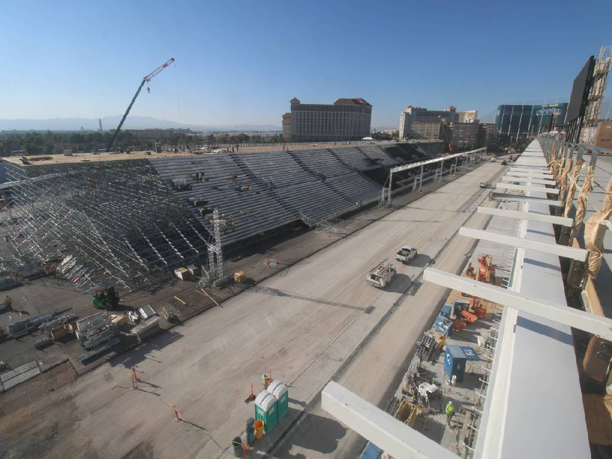

# 🏎️ F1

Scrapes a live photo every ~15 minutes of the Formula 1 racetrack build
progression in Las Vegas, NV. Scheduled completion is October 2023.

## Summary

The majority of the work happens in [`main.ts`](./main.ts). It is run every 15
minutes by a GitHub Actions workflow in
[`main.yml`](./.github/workflows/main.yml). Images are stored in the
[`./assets`](./assets) folder, with their time of scrape for filenames.

The script is pretty basic, and has 0 dependencies other than Deno. It fetches
the latest image from a live feed, saves it to `./assets`, and makes a copy to
`latest.jpg` for convenience.

Aside from that, it's just some basic logging and error handling.

At the end of the project the images will be stitched together into a timelapse.

## Latest Image

### Image Source

The data source on the scraped images is an updating live photo feed sourced
from the official Formula 1 website. As long as it remains up and transmitting
data, this project will continue to auto-update.

> This project will continue to update until the track is completed, but could
> be discontinued at any time if the image stream becomes unavailable.

### Tools Used

- [x] [`Deno v1.34`](https://deno.land/manual@v1.34.1)
- [x] [`GitHub Actions`](https://github.com/actions)
- [x] [`TypeScript 5.0.4`](https://typescriptlang.org/)

---

 

[**MIT**](https://nick.mit-license.org) ©
[**Nicholas Berlette**](https://github.com/nberlette)

•••

##### This project is not affiliated with Formula 1, the FIA, or any of their subsidiaries. This project is not for profit, and is intended for educational purposes only. The image stream data is copyright its respective authors and owners.

###### _I'm just a fan with a code habit._

